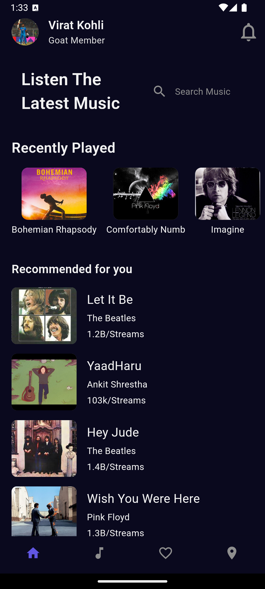
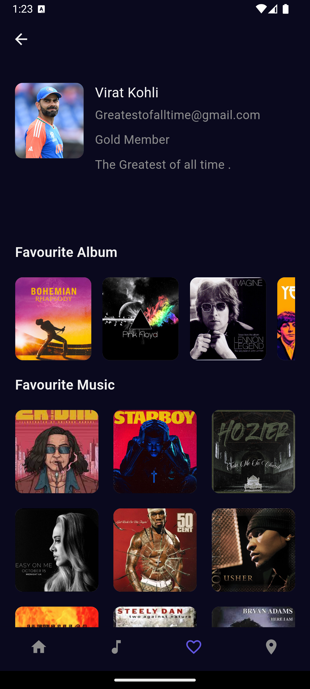

# Music App UI

Welcome to the Music App UI built with Flutter! This project showcases a sleek and intuitive music player interface, complete with user profiles, favorite albums, and favorite music sections.

## Features

- **User Profile Display**: Includes avatar, name, email, membership status, and tagline.
- **Favorite Albums**: Showcases the user's top albums with cover images.
- **Favorite Music**: Displays the user's preferred tracks with cover images.
- **Music Player**: Allows users to play their favorite songs with a beautiful and functional UI.

## Tech Stack

- **Flutter**: The UI framework used to build the application.
- **Dart**: The programming language used in Flutter.

# Demo: 

  
  
  

  

## Installation and Usage

1. **Clone the repository**:

   - git clone https://github.com/Abinash022/flutter-music-ui

2. Navigate to the project directory:

    - cd music-app-ui

3. Install the dependencies:

    - flutter pub get

4. Run the application:

    - flutter run

# Contribute

We welcome contributions to enhance the Music App UI. Feel free to fork the repository and submit pull requests.

# Follow Me
- LinkedIn: https://www.linkedin.com/in/abinash-karki/
- Twitter: https://x.com/Abinash49122205

Encourage collaboration and stay updated with the latest features and improvements. Don't forget to star the repository if you found it useful!

HAPPY CODING🖥️🎉